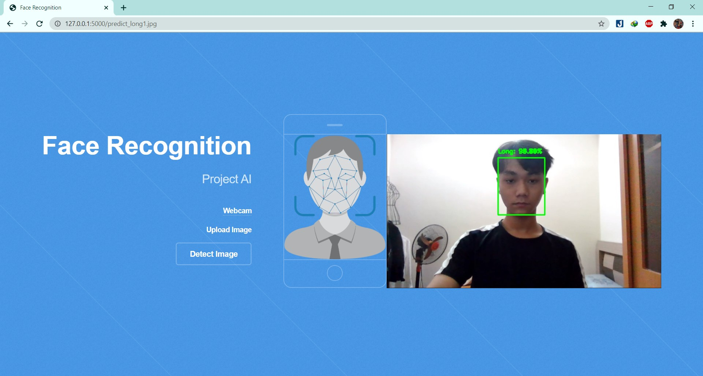
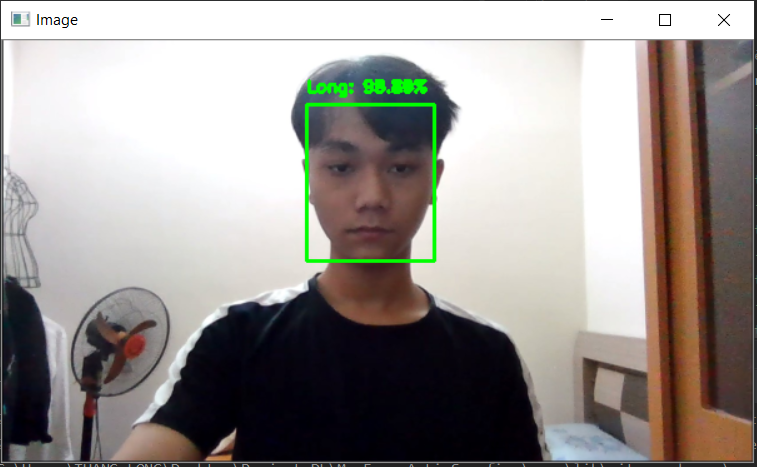
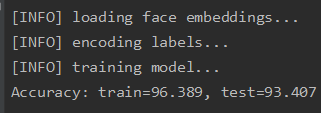

# Face-Recognition-TL-

## INTRODUCTION ##
My Course Project - Nhập môn Trí tuệ nhân tạo - HUST
## PROJECT DEMO ##
- **Demo web by Flask**

- **Recognize image**

- **Recognize video**

## FRAMEWORK USED ##
- OpenCV
- Skicit-learn
- Caffe-based face detector
- openface_nn4.small2.v1.t7
- Flask

## INSTALLATION AND RUNNING ##
1. Clone repo
2. Open project by Pycharm
3. Cài các thư viện cần thiết

    `pip install -r requirements.txt`
 
4. Tạo folder videos và thêm video mẫu vào videos
5. Tạo folder dataset, trong folder dataset tạo folder có tên tương ứng với các video trong videos, ví dụ: video mẫu: Long.mp4 thì trong dataset tạo folder Long 
4. Open source code and read how to run code

## RESULT ##

